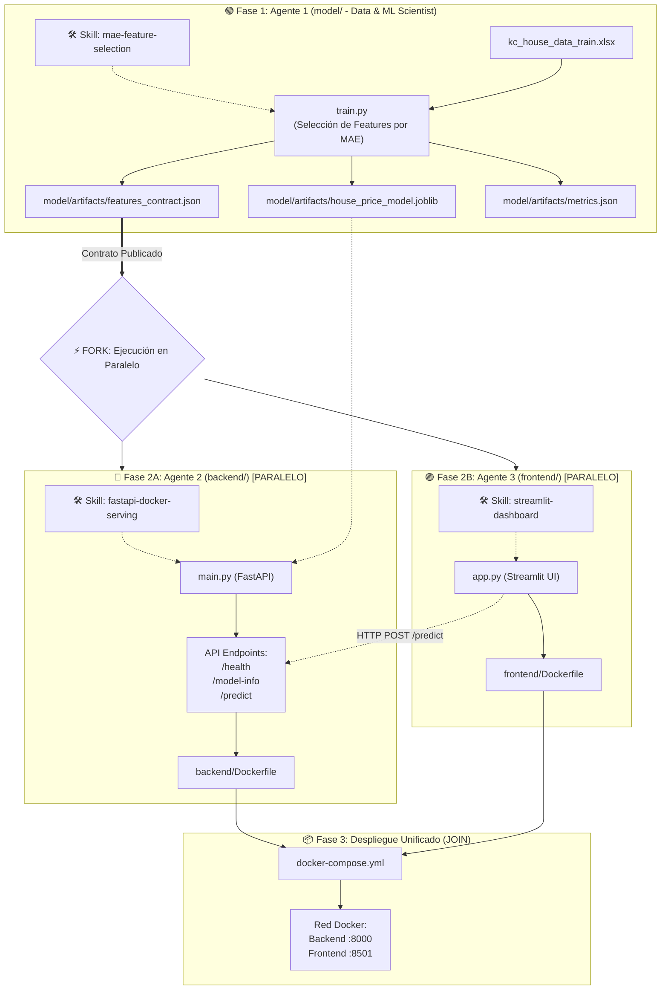

# ORQUESTADOR GENERAL DEL PROYECTO (Multi-Agente)

Este proyecto está dividido en 3 sub-agentes especializados organizados por carpeta. Cada uno tiene su propio `AGENTS.md` y conjunto de responsabilidades.

## Diagrama de Flujo y Orquestación (Graph TD)

## Asignación de Modelos LLM y Skills por Agente

| Sub-Agente   | Carpeta     | Color      | Modelo LLM    | Skill Asignada (`.agents/skills/`) | Modo de Ejecución |
| :----------- | :---------- | :--------- | :------------ | :--------------------------------- | :---------------- |
| **Agente 1** | `model/`    | 🟢 Verde   | **Gemini 3.6** | `mae-feature-selection`            | **Secuencial** (Paso 1, genera contrato) |
| **Agente 2** | `backend/`  | 🔵 Cian    | **Gemini 3.8** | `fastapi-docker-serving`           | **⚡ Paralelo** (Paso 2A, consume contrato) |
| **Agente 3** | `frontend/` | 🟣 Magenta | **Gemini 3.8** | `streamlit-dashboard`              | **⚡ Paralelo** (Paso 2B, consume contrato) |

> **Criterio de Selección de Modelos:**
> - **Gemini 3.6 (Model):** Optimizado para cálculo analítico, procesamiento de datos tabulares, bucles de entrenamiento y selección de features con mínima latencia y costo.
> - **Gemini 3.8 (Backend & Frontend):** Mayor capacidad de razonamiento, estándares de seguridad web (OWASP, validación estricta de esquemas, sanitización de inputs y CORS) y robustez en entornos productivos Docker.

## Reglas de Orquestación: Patrón Fork-Join (Paralelo)

1. **Fase 1 (🟢 Agente 1 - Bloqueante):**
   - Se ejecuta primero de forma obligatoria.
   - Entrena el modelo y publica el **contrato de datos** (`model/artifacts/features_contract.json`) junto al modelo `.joblib`.

2. **Fase 2 (⚡ Agente 2 y Agente 3 - En Paralelo):**
   - **Agente 2 (🔵 Backend):** Lee el contrato y construye la API FastAPI (`main.py`, `schemas.py`) y `Dockerfile`.
   - **Agente 3 (🟣 Frontend):** Lee el mismo contrato en paralelo y construye la interfaz Streamlit (`app.py`) con sus controles dinámicos y `Dockerfile`.
   - *¿Por qué pueden trabajar al mismo tiempo?* Porque ambos se basan en la especificación formal del contrato (`features_contract.json` y el endpoint acordado `POST /predict`), sin bloquearse mutuamente.

3. **Fase 3 (📦 Join & Despliegue):**
   - Una vez finalizados ambos agentes, se integra `docker-compose.yml` para levantar y conectar ambos servicios en una sola red.
