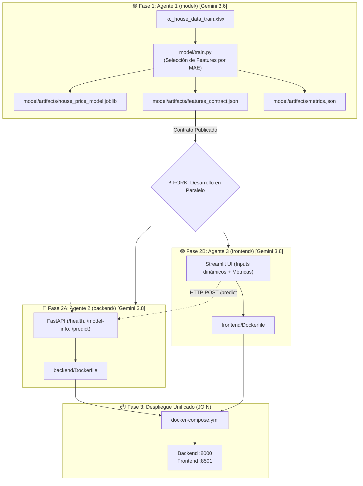

# 🏡 King County House Price Prediction - Multi-Agent System

Sistema multi-agente para entrenamiento, servicio y visualización de modelos de Machine Learning para estimación del precio de viviendas en King County (`kc_house_data_train.xlsx`), optimizando **MAE** y desplegado con **Docker Compose**.

---

## 🏛️ Arquitectura Multi-Agente (Fork-Join)



---

## 🤖 Especialización de Agentes y Modelos LLM

| Sub-Agente | Carpeta | Color | Modelo LLM | Skill Asignada | Rol |
| :--- | :--- | :--- | :--- | :--- | :--- |
| **Agente 1** | `model/` | 🟢 Verde | **Gemini 3.6** | `mae-feature-selection` | Feature Selection y optimización de MAE. |
| **Agente 2** | `backend/` | 🔵 Cian | **Gemini 3.8** | `fastapi-docker-serving` | Microservicio REST seguro con FastAPI y Pydantic. |
| **Agente 3** | `frontend/` | 🟣 Magenta | **Gemini 3.8** | `streamlit-dashboard` | UI reactiva en Streamlit para inferencias en tiempo real. |

---

## 📈 Resultados del Modelo (Fase 1)

- **Algoritmo:** `HistGradientBoostingRegressor`
- **Métrica Principal:** Minimización de **MAE (Mean Absolute Error)**
- **Variables Seleccionadas (18):** `grade`, `sqft_living`, `lat`, `long`, `sqft_living15`, `yr_built`, `waterfront`, `sqft_above`, `sqft_lot`, `zipcode`, `sqft_lot15`, `view`, `bathrooms`, `sqft_basement`, `condition`, `bedrooms`, `yr_renovated`, `floors`.
- **CV MAE:** `$68,164.44 USD`
- **Test MAE (Holdout):** **`$66,734.92 USD`**
- **$R^2$ Score:** **`0.8934`**

---

## 🚀 Despliegue y Ejecución Rápida

### Con Docker Compose (Recomendado)

```bash
docker compose up -d --build
```

- **Frontend (Streamlit):** [http://localhost:8501](http://localhost:8501)
- **Backend (FastAPI Docs):** [http://localhost:8000/docs](http://localhost:8000/docs)
- **Healthcheck:** [http://localhost:8000/health](http://localhost:8000/health)

---

## 📂 Estructura del Repositorio

```text
kcPrice_webWithAgents/
│
├── AGENTS.md                    # 🗺️ Orquestador global y reglas del sistema
├── README.md                    # 📖 Documentación general
├── docker-compose.yml           # 📦 Orquestador de servicios
├── kc_house_data_train.xlsx     # 📊 Dataset de entrenamiento
│
├── .agents/skills/              # 🛠️ Skills especializadas
│   ├── mae-feature-selection/
│   ├── fastapi-docker-serving/
│   └── streamlit-dashboard/
│
├── model/                       # 🟢 Agente 1 (Data & ML)
│   ├── AGENTS.md
│   ├── train.py
│   └── artifacts/
│       ├── house_price_model.joblib
│       ├── features_contract.json
│       └── metrics.json
│
├── backend/                     # 🔵 Agente 2 (Backend & Docker)
│   ├── AGENTS.md
│   ├── main.py
│   ├── schemas.py
│   ├── requirements.txt
│   └── Dockerfile
│
└── frontend/                    # 🟣 Agente 3 (Frontend & UI)
    ├── AGENTS.md
    ├── app.py
    ├── requirements.txt
    └── Dockerfile
```
